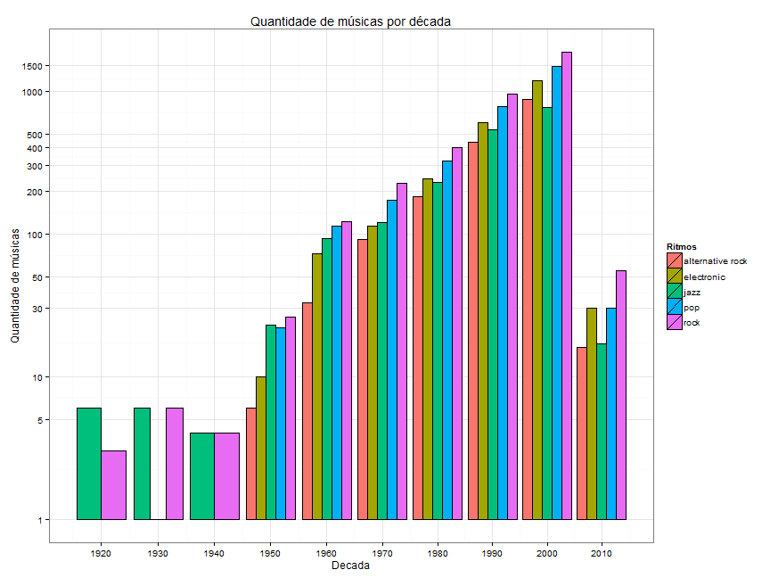

Problema 02
========================================================
Quais paí­ses tem os artistas mais populares/familiares por estilo?
--------------------------------------------------------
Para gerar essa visualização separei os artistas de acordo com seu paí­s e calculei a media de popularidade e familiaridade de cada paí­s.

 

Com este gráfico fica fácil perceber quais paí­ses tem os artistas mais familiares mas fica difí­cil comparar os valores de um só pais então gerei a seguinte visualização:

 

 

Com este gráfico fica fácil perceber quais paí­ses tem os artistas mais populares mas fica difí­cil comparar os valores de um só pais então gerei a seguinte visualização:

 

Depois de observar os gráficos percebemos que o paí­s que tem os artistas mais populares e familiares é o Reino Unido.

Quais os gêneros produzem mais músicas ao longo das décadas?
--------------------------------------------------------

Para gerer essa visualização combinei os dados de musicas com termos e agrupei em décadas para assim ter a contagem de musicas para cada uma delas.

 

Fica fácil de perceber no gráfico que o gênero quem mais produz musica é o Rock
