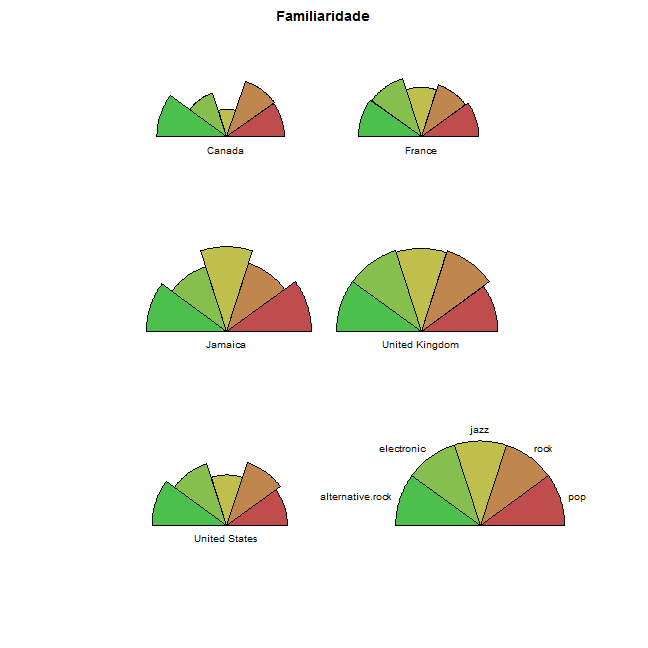
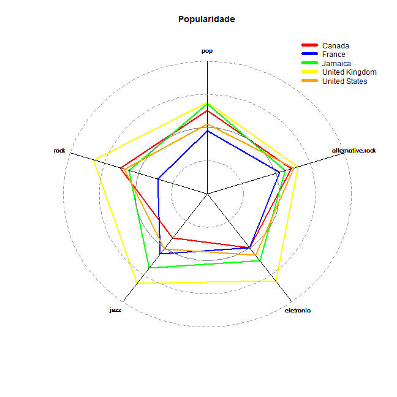

Problema 02
========================================================
**Implemente um relatório usando RMarkdown + ggplot2 (+ quaisquer bibliotecas que você queira) que responda a 2 das perguntas que você criou na parte 2 implementando as visualizações que você criou na parte 3 deste problema. O relatório pode ser sucinto, mas deve, além de mencionar as perguntas e apresentar as visualizações, apresentar a sua resposta para a pergunta e a sua interpretação desta resposta. (Isso é, o que ela significa).**
**A.Trace um esboco do caminho que ele percorreu analisando os dados para responder essas perguntas.**

Quais países tem os artistas mais populares/familiares por estilo?
--------------------------------------------------------
Para gerar essa visualização separei os artistas de acordo com seu país e calculei a media de popularidade e familiaridade de cada país.

 

Com este gráfico fica fácil perceber quais países tem os artistas mais familiares mas fica difícil comparar os valores de um só pais então gerei a seguinte visualização:

 

 

Com este gráfico fica fácil perceber quais países tem os artistas mais populares mas fica difícil comparar os valores de um só pais então gerei a seguinte visualização:

 

Depois de observar os gráficos percebemos que o país que tem os artistas mais populares e familiares é o Reino Unido.

